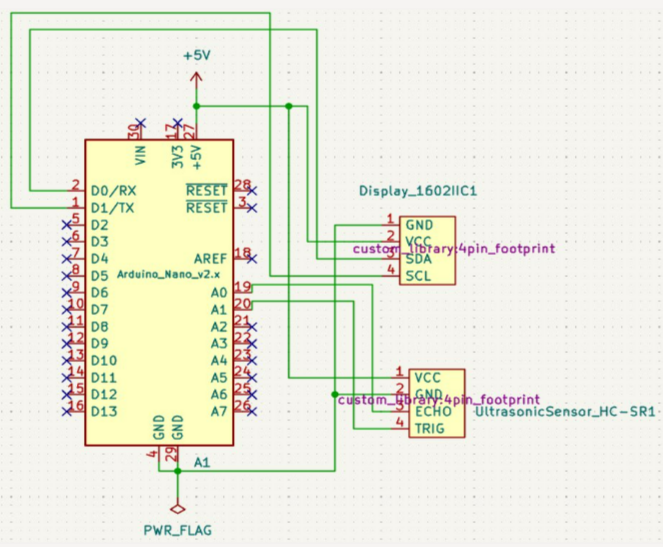
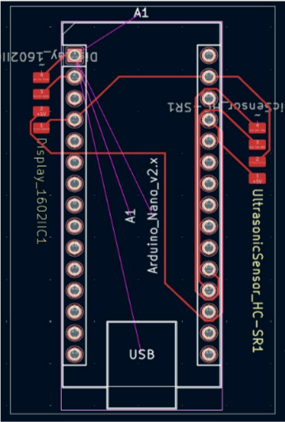
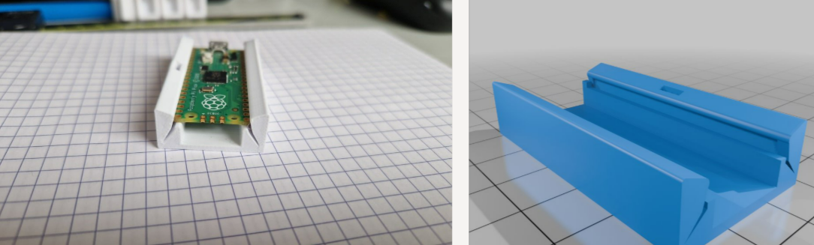

# Ultrasonic-Distance-Checker-with-I2C-LCD-Displa

This project implements an ultrasonic distance measurement system using an Arduino Uno R4 Minima and a 1602 I2C LCD display. The system measures distances in centimeters and displays real-time readings on the LCD screen.

#Components Used:

Arduino Uno R4 Minima

HC-SR04 Ultrasonic Sensor

1602 I2C LCD Display

Jumper wires & breadboard

#Features:

Measures distance using the HC-SR04 ultrasonic sensor.

Displays real-time distance readings on a 1602 I2C LCD screen.

Uses efficient I2C communication to control the LCD display.

Simple and easy-to-understand Arduino code, perfect for beginners in embedded systems and sensor interfacing.

#How It Works:

The ultrasonic sensor sends a pulse and waits for the echo.

The duration of the echo is measured, and the distance is calculated using the speed of sound.

The distance is then displayed on the LCD every 3 seconds.

